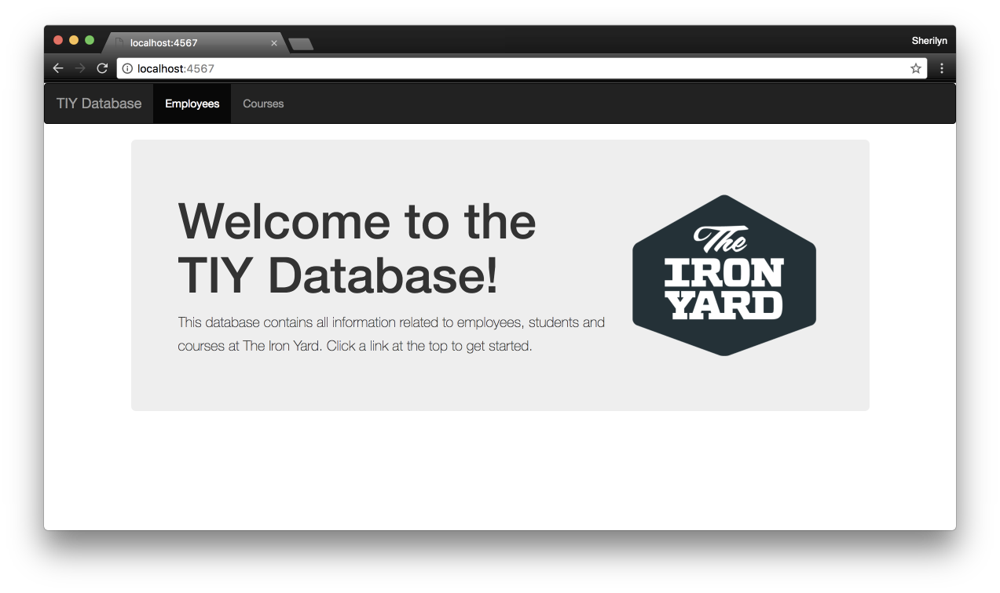
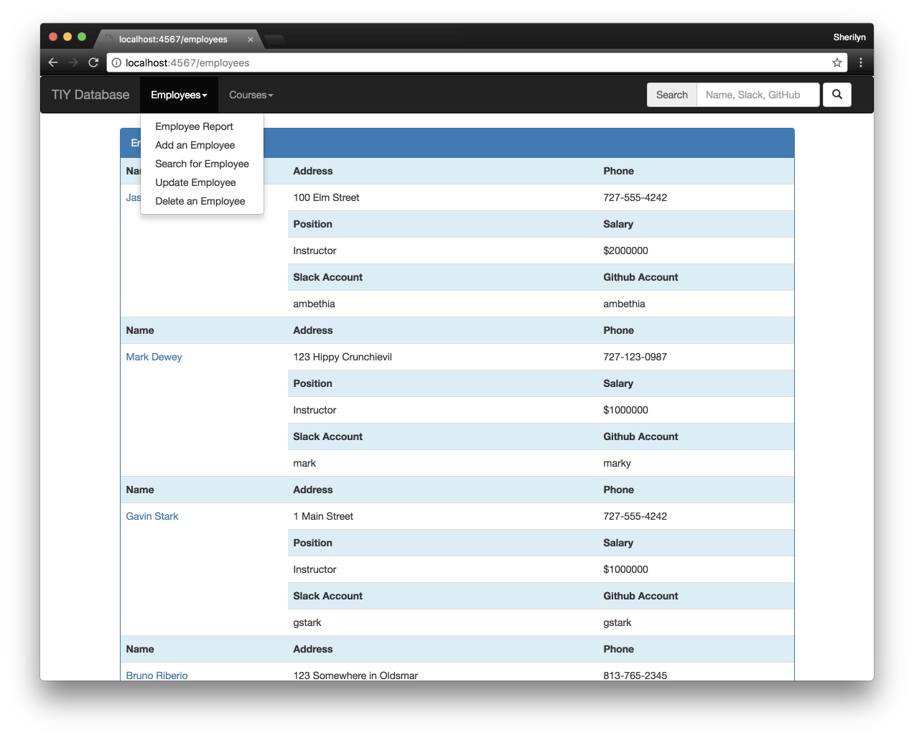
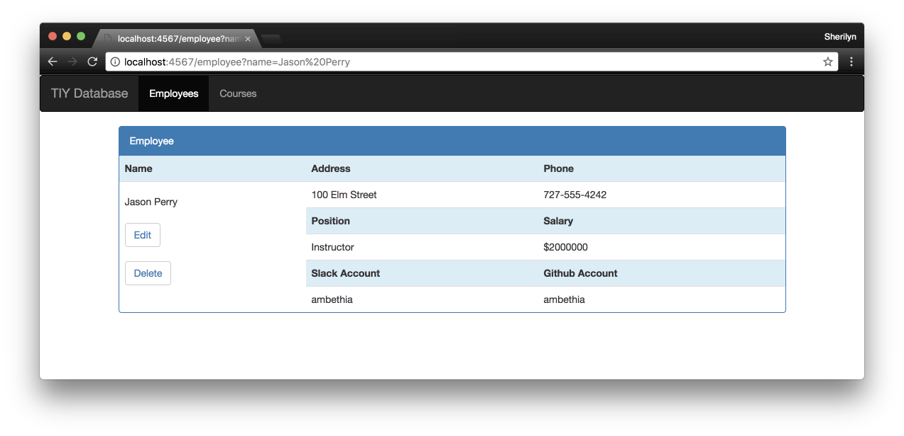

# TIY Database with Sinatra and Postgresql

* To start this program you must have pstgresql and the sinatra gem installed    
  * createdb tiy-database
  * pgcli tiy-database
  * CREATE TABLE employees(id serial, name text, phone text, address text, position text, salary integer, github text, slack text)
  * run from the command line: ruby tiydatabase.rb
  * open your browser to http://localhost:4567/

### This the the TIY Database completely redone using Sinatra and Postgresql

* The top navigation menu has an entry for Employees
* When you click the Employees nav item it takes you to an employee index URL which shows:
  * List of all employees in a table containing: name, phone, address, position, salary, slack, github
  * Each row in the table has a link to show that employee
* On the employee index URL there is a link to take the user to a new employee URL which has a form to fill in the details of an employee with a submit button.
* Once the new employee is created the user is sent back to the employee index url
* It has a search function with a search button that allows you to search by:
  * name (partial)
  * slack (full match)
  * github (full match)
* The employees information is shown in a nice format
* There is an edit function that takes the user to a form with the employees existing details populated

* Ability to delete an employee was added on the Employee Show page, the user is then redirected to the employee index

* Created a similar system for managing courses in this database as well

### Landing Page

### Employees Index

### Employee Show

